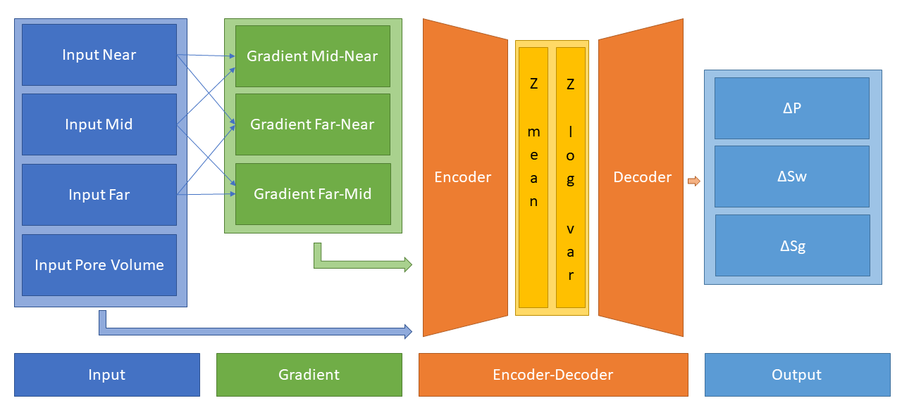
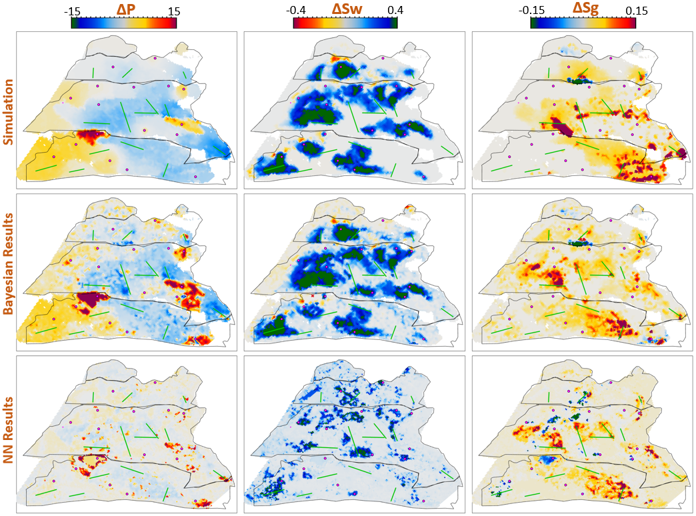

# Deep Neural Networks for Map-Based 4D Seismic Pressure-Saturation Inversion

This repository reproduces the results in the following publications:

> [Dramsch, J. S.](https://orcid.org/0000-0001-8273-905X), Corte, G., [Amini, H.](https://orcid.org/0000-0001-9588-6374), [Lüthje, M.](https://orcid.org/0000-0003-2715-1653), & [MacBeth, C.](https://orcid.org/0000-0001-8593-3456). (2019, April). Deep Learning Application for 4D Pressure Saturation Inversion Compared to Bayesian Inversion on North Sea Data. In Second EAGE Workshop Practical Reservoir Monitoring 2019.

> [Dramsch, J. S.](https://orcid.org/0000-0001-8273-905X), Corte, G., [Amini, H.](https://orcid.org/0000-0001-9588-6374), [MacBeth, C.](https://orcid.org/0000-0001-8593-3456), & [Lüthje, M.](https://orcid.org/0000-0003-2715-1653). (2019). Including Physics in Deep Learning--An example from 4D seismic pressure saturation inversion. arXiv preprint arXiv:1904.02254.

## Architecture
The network architecture includes basic physics (AVO) on the input data to learn noisy gradients and learn the residual.

## Results

